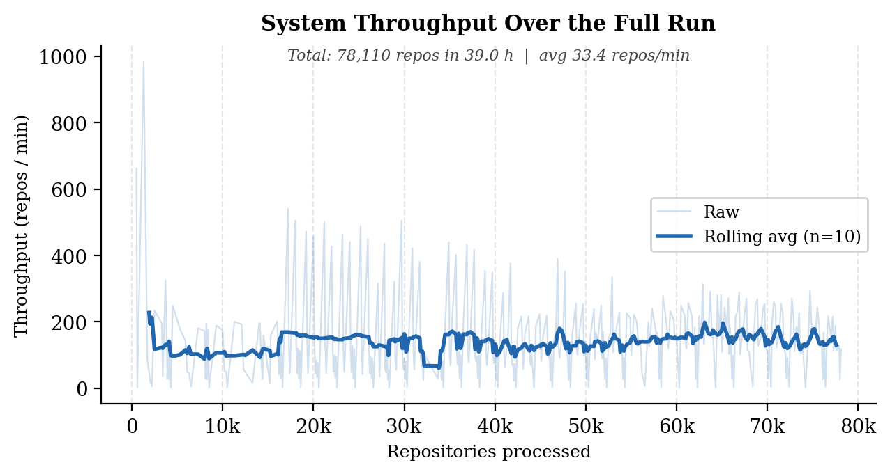
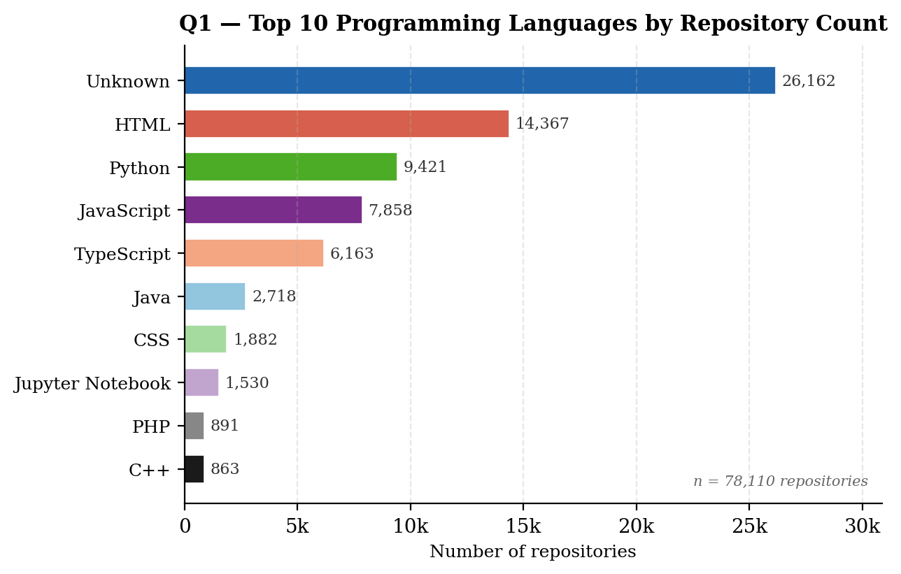
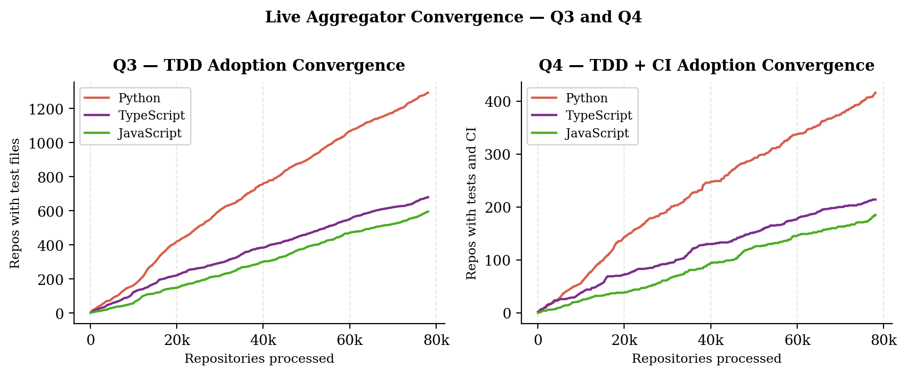
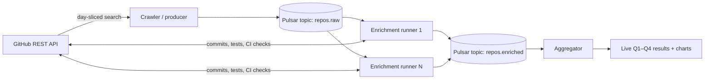

# Scalable Stream Processing with Apache Pulsar

[](https://github.com/tj-chakravarthy/Data-Engineering-II-Project-2/actions/workflows/ci.yml)

A distributed GitHub analytics pipeline: a rate-limit-aware crawler streams repository metadata through Apache Pulsar to horizontally scalable enrichment workers and a live aggregator, deployed with Docker Swarm on OpenStack cloud VMs.

Built by a team of five for Uppsala University's 1TD076 Data Engineering II course (Group 16, spring 2026). The full write-up — architecture, methodology, and scalability experiments — is in the [project report (PDF)](report/DE2_Project_Group16.pdf).

## Results at a glance

A continuous ~39-hour run collected, enriched, and analyzed **78,110 unique GitHub repositories** (36,185 served from the crawler's disk cache rather than re-crawled), answering four analytics questions live as data streamed through the pipeline:

<p align="center"></p>

<p align="center"></p>

The aggregator publishes rankings continuously, so answers are available (and stable) long before the run completes — Q1 language ranks fix within the first ~1,000 repositories, and the Q3/Q4 leaders emerge almost immediately:

<p align="center"></p>

Scalability experiments (30-minute runs, one variable at a time):

| Variable | Effect on throughput |
|---|---|
| Enrichment runners (1 → 4) | **23 → 65 repos/min** — the dominant factor, until API capacity saturates |
| GitHub API tokens (1 → 5) | **13 → 66 repos/min** — confirms external API access is the bottleneck |
| Worker VMs (1 → 4) | None (~66 repos/min) — workload is I/O-bound, not CPU-bound |
| Runner→aggregator batch size | Small — Pulsar transport is cheap relative to enrichment |

The honest takeaway: each repository costs 3–19 extra GitHub API calls to enrich, so performance is governed by token budget and request parallelism, not compute. Details and latency analysis are in the [report](report/DE2_Project_Group16.pdf).

## Architecture



Engineering decisions worth a look:

- **Predictive token pool** (`src/crawler/github_client.py`) — every request goes to the token with the most remaining quota as last reported by GitHub, instead of naive round-robin that hammers one token until it 429s. Rotation, bounded sleeps, and a total-wait budget handle full-pool exhaustion.
- **Adaptive search splitting** (`src/crawler/crawl.py`) — GitHub search caps any query at 1,000 results, so the crawler day-slices the date range and recursively subdivides UTC time windows until every leaf query fits under the cap. Verified live: a one-day `pushed:` query at `stars:>=100` (~17k results) splits into 24 compliant leaf ranges.
- **At-least-once delivery with idempotent consumers** — the producer uses async sends with bounded in-flight messages, per-record retry budgets, and an optional checkpoint file; every consumer dedupes on `repo_id`. Duplicates are expected and handled, not assumed away.
- **Backpressure** — the crawler monitors the `repos.raw` backlog and pauses publishing when runners fall behind.
- **Disk-cached crawling** — per-day NDJSON cache means reruns and overlapping experiments don't burn API quota; nearly half the 78k-repo dataset came from cache.
- **Runtime-adaptive analytics** — `TOP_N`, batch sizes, and flush intervals are deployment configuration, so "top 10 → top 20" is a config change and an aggregator restart, with no code changes.

Messages on `repos.raw` are raw crawler JSON (no envelope), partitioned by `repo_id`; runners publish enriched batches to `repos.enriched` for the aggregator.

## Repository layout

```
src/crawler/       GitHub search crawler: day slicing, adaptive splitting, token pool, cache
src/streaming/     Pulsar producer (async, retrying, checkpointed) and connection handling
src/analytics/     Enrichment runners, live aggregator, result plotting
scripts/infrastructure/   OpenStack + cloud-init provisioning, Docker Swarm deployment
scripts/process-results/  Result collection from the cluster
tests/             92 unit tests (no network or broker required)
report/            Final report (PDF + LaTeX source) and all result figures
```

## Getting started

Requires Python 3.11+ on Linux.

```bash
python3 -m venv .venv && source .venv/bin/activate
pip install -r requirements.txt
PYTHONPATH=src python3 -m unittest discover -s tests
```

The 92 tests cover date slicing, dedup, adaptive range splitting, rate-limit retry budgets, async publish/retry/checkpoint behavior, and the analytics enrichment and aggregation logic — all runnable offline in about a second.

## Running the crawler

Two entry points share the same crawler core:

- **`streaming.pulsar_producer`** — streams each record live to a Pulsar topic (the end-to-end pipeline path).
- **`crawler.cli`** — same crawl, but writes to a local NDJSON file. Handy without a broker.

```bash
export PYTHONPATH=src

# Offline smoke run
python3 -m crawler.cli --days 1 --limit 25 --output data/output/repos.ndjson

# Live publish to Pulsar
python3 -m streaming.pulsar_producer \
  --broker pulsar://localhost:6650 \
  --topic repos.raw \
  --days 365 \
  --date-field created-or-pushed \
  --cache-dir data/cache \
  --output data/output/repos.ndjson \
  --checkpoint-path data/output/repos.published.json
```

Useful flags (shared by both entry points):

- `--date-field created|pushed|created-or-pushed` — GitHub search date qualifier. GitHub's search API has no `updated:` qualifier (caught in live testing), so "updated in the last year" maps to `pushed:`.
- `--query "stars:>=10 archived:false"` — extra search qualifiers for scoping a crawl to the available rate-limit budget.
- `--checkpoint-path PATH` — persist published `repo_id`s; restarts skip them.
- `--max-in-flight N` — bound outstanding async sends to keep memory flat when the broker is slow.
- `--limit N`, `--refresh-cache`, `--no-cache`, `--memory-log-every N` — test caps, cache control, observability.

The crawler logs `search_cap_warnings` and `incomplete_search_warnings`; both must be zero before a crawl counts as complete. `scripts/validate_crawler_output.py` validates an NDJSON file before downstream ingestion.

GitHub tokens are configured via environment (`.env`): any variable starting with `GITHUB_TOKEN` joins the pool. Copy `scripts/infrastructure/.env.example` and fill in your own values — no credentials are tracked in this repo.

## Cloud deployment

`scripts/infrastructure/` provisions a Docker Swarm cluster (one manager, four workers, Ubuntu 22.04) on OpenStack via cloud-init, then deploys the Pulsar + crawler + analytics stack:

```bash
cd scripts/infrastructure
cp .env.example .env                            # fill in GitHub tokens
cp UPPMAX-openrc.sh.template UPPMAX-openrc.sh   # fill in OpenStack credentials
./run.sh <PUBLIC_KEY_NAME> <PRIVATE_KEY_PATH>
```

`run.sh` provisions the VMs and ships the repo to the manager; `setup_swarm.sh` deploys the stack (the image named by `PULSAR_CLIENT_IMAGE`, built via `src/build_and_push.sh`) and finishes by running `verify_swarm_pipeline.sh`, an end-to-end smoke check of the deployed pipeline. `teardown_swarm.sh` tears everything down. Scaling runners or workers is a `docker service scale` / swarm-join away — which is exactly how the report's experiments were run.

Two companion branches preserve development history referenced in the report: [`experiments`](../../tree/experiments) (experiment automation and measurement scripts; final versions are integrated into `main`) and [`auto-floating-ip`](../../tree/auto-floating-ip) (automatic floating-IP assignment via the OpenStack API, developed after the experiment runs).

## Team

| | Main areas (see commit history) |
|---|---|
| Tejas (TJ) Chakravarthy | Crawler (adaptive splitting, token pool, caching), Pulsar producer, pipeline verification, floating-IP automation |
| Andreas Hadjoullis | OpenStack/cloud-init provisioning, Docker Swarm deployment automation, system integration |
| Julios Fotiou | Crawler backpressure, results collection scripts, report writing |
| Adnan Erlangga Raharja | Scalable enrichment runners, aggregator, plotting, unit tests |
| Tanay Singh | Results analysis, rank-stability and convergence figures, report results |

## What we'd improve next

- Integration tests for the producer → broker → consumer path (e.g., CI with a Pulsar service container) on top of the existing unit suite.
- A schema registry (Avro/JSON Schema) on the topics instead of implicit raw-JSON contracts.
- Exactly-once result accounting via Pulsar transactions or a persistent dedup store, replacing in-memory `repo_id` sets.
- Non-root containers and pinned image digests in the Dockerfile.
- Linting and type checking (ruff, mypy) in CI.

## License

[MIT](LICENSE)
